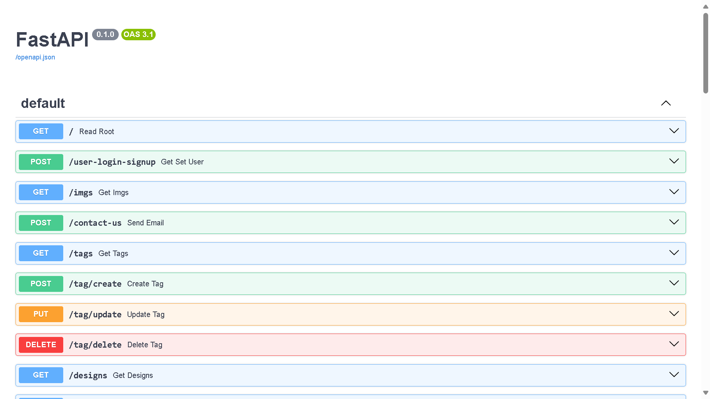

# Memorable Backend
## Description
Memorable Backend is the core server-side component of the Memorable application, focusing on personalized wine bottle customization and ordering. It handles data for the designs that are shown and much more.

## Core Features
- **Show Designs:** Allows users to view designs and admins to manage them.
- **Order Management:** Facilitates the advertisement of new orders to admins.
- **AI-Powered Design Suggestions:** Utilizes generative AI to suggest wine bottle designs based on search inputs.
- **User Login/Signup:** Provides functionality for user login and signup using FastAPI.
- **Database Management:** Includes CRUD operations for managing users, designs, tags, and extra information in the database.
- **Email Sending:** Enables sending emails using the SendEmailClass.
- **Cloudinary Integration:** Integrates with Cloudinary for image uploads and transformations.
- **WhatsApp Bot Functions:** Implements functions for sending WhatsApp messages and images.
- **Admin Authentication:** Implements an `admin_only` decorator to restrict access to admin-only routes.

## Technologies Used
- **Python:** Serves as the primary programming language, offering robustness and flexibility for backend development.
- **FastAPI:** A modern, fast (high-performance) web framework for building APIs with Python 3.6+ based on standard Python type hints.
- **SQLite:** A C-language library that implements a small, fast, self-contained, high-reliability, full-featured, SQL database engine.
- **Cloudinary:** Cloud-based image and video management solution.
- **Pydantic:** Data validation and settings management using Python type annotations.
- **Uvicorn:** Lightning-fast ASGI server implementation, using uvloop and httptools.

